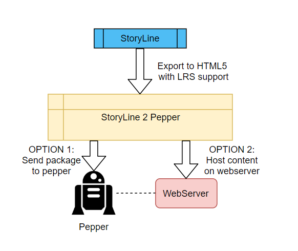

# ROBO-CURE

## Introduction

Arinti has been working on a robotics research project named [ROBO-CURE](http://smit.vub.ac.be/project/robo-cure).
The purpose of ROBO-CURE is to assess the chemistry between Social Robotics, Internet of Things and Artificial Intelligence when applied for medical purposes. The project is part of [ICON](https://www.imec-int.com/nl/imec-icon) and includes multiple partners from the private and public sector.

We at [Arinti](https://arinti.ai/) teamed up with our colleagues at [The Learning Hub](http://www.thelearninghub.be/) to seamlessly merge E-Learning with Social Robotics. Our target was to create digital learning content which could be taught by a humanoid robot, without specialist programming. We chose to name our solution as **StoryLine 2 Pepper** since it can be described by a tool that makes storyline content compatible with the Pepper robot.

[Pepper](https://www.softbankrobotics.com/emea/en/robots/pepper) has been used for robotics research worldwide, and is specifically suited for social robotics, which makes it an ideal candidate for ROBO-CURE.

To view the full scope of the ROBO-CURE project, take a look at http://smit.vub.ac.be/project/robo-cure.

## Can a robot educate?

[Researchers at Plymouth](https://www.plymouth.ac.uk/news/robots-have-power-to-significantly-influence-childrens-opinions) have previously shown that children respond very well to robots when it comes to influencing opinions. This makes them suited for the role of educator.

A humanoid robot can react based on the behaviour and actions of the child. Although a tablet could be used for the same kinds of interaction, the lack of social interaction is a key difference. However, to broaden our scope, the proposed solution also supports the use of a browser if there is no robot available.

## StoryLine 2 Pepper

StoryLine 2 Pepper is the name of our approach to make StoryLine output fully integrated with the Pepper robot.
By minimizing custom development and using as much out-of-the-box functionalities as possible provided by StoryLine, we can make sure our approach is suitable for end-users. We chose to use storyline because of the export capabilities which can be easily extended using Javascript. StoryLine can be integrated with an LRS system such as Learning Locker. This makes it relatively easy to monitor the education of the patient. StoryLine is a leader in the E-Learning community, and is similar to PowerPoint. The learning content created in StoryLine can be exported to HTML content with integrated LRS support. This content can be adapted to add an interface that provides interaction with the robot. This interface can be accessed from within StoryLine using the Javascript support. This might sound technical but all actions can be achieved with 1 line of code. When a learning module is started, pepper will introduce himself before asking the patient if he wants to proceed. This introduction is always added by StoryLine 2 Pepper. 

We refer to the exported HTML content, after it has been processed by StoryLine 2 Pepper, by a Learning module.

### End-user programming

This is an example of a question, and the corresponding answers.
After the answer is recognized a variable with the same name in StoryLine will be incremented.
The end-user can subscribe to the change of this variable, and configure storyline to act accordingly.  

```Javascript
    Listen("What is 1 + 4", ["five", "four", "eight", "ten"]);
```

In this command, the user can specify whether the robot should automatically proceed to the next slide after pronouncing the sentence.

```Javascript
    Say("Hello, I am pepper!", { goToNextSlide: false });
```

Since there are only 2 commands available, adding the interaction in StoryLine is very convenient.
Adding browser support also adds the benefit that all learning modules can be fully tested without the need of a robot.

### Browser APIs

When activating browser-support, the learning module makes use of modern browser features such as [Web Speech API](https://developer.mozilla.org/en-US/docs/Web/API/Web_Speech_API) and [SpeechSynthesis](https://developer.mozilla.org/en-US/docs/Web/API/SpeechSynthesis) to handle speech recognition & pronounciation.

### Audio Normalization

Another available feature is the normalization of audio in all `.mp4` files found within the StoryLine output.
This feature is optional and rather experimental, but within reason it will try to normalize the volume of video files to be of equal volume as the speech-to-text service of pepper.

### Modes of interaction

1. SpeechRecognition (voice)
2. Tablet (touch)

Using the visual capabilities of the tablet, it is possible to hint which words are expected by the robot, to improve recognition. Some tolerance has been built in, when the robot is unable to recognize what has been said, or is not able to map it to a correct behaviour, it will ask the patient to repeat. This process continues until the robot can proceed. To make sure the patient does not get stuck, every interaction is also achievable using the tablet. This is however seen as a backup option, since it reduces the advantages of a social robot.

### Loosely coupled

Given a scenario where the learning modules are deployed on a webserver, an intelligent task scheduling system can start a module on a specified Pepper robot, and log to a specified LRS. There are no references to the specific Pepper robot, or the specified LRS system, in the learning modules themselves.

## Deploying the learning content to the robot

The modules that have been created in the previous step now need to be displayed on the robot. This is the part where the other partners jump in. A task scheduler has been set in place by [`imec`](https://www.imec-int.com/nl/). This scheduler will launch the modules at the necessary time for the patient, with monitoring provided by the LRS integration. The only technical necessity is that the modules that have been made using the StoryLine application, will be either uploaded to the robot, or hosted on a webserver.



## Conclusion

We have made available the production of learning content without technical know-how, that can be delivered to the audience by a humanoid robot. By making use of the highly interactive StoryLine application, it augments the functionalities provided by a recognized leader in E-Learning. Educational results can be monitored easily because of the native integration between StoryLine and LRS Systems. At the time of writing the integration project only supports the Pepper robot, but it should be relatively easy to add other robots, providing they have a tablet and Javascript API.

## Thanks to all the involved partners

- Cronos - Arinti
- Cronos - The Learning Hub
- QBMT
- UZ Brussel
- Medtronic Belgium
- imec - IDLab - UGent
- imec - SMIT - VUB
- VUB - GRON
- VUB - R&MM
